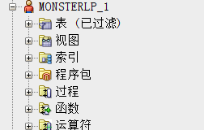
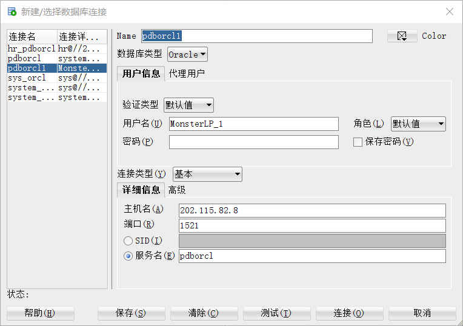
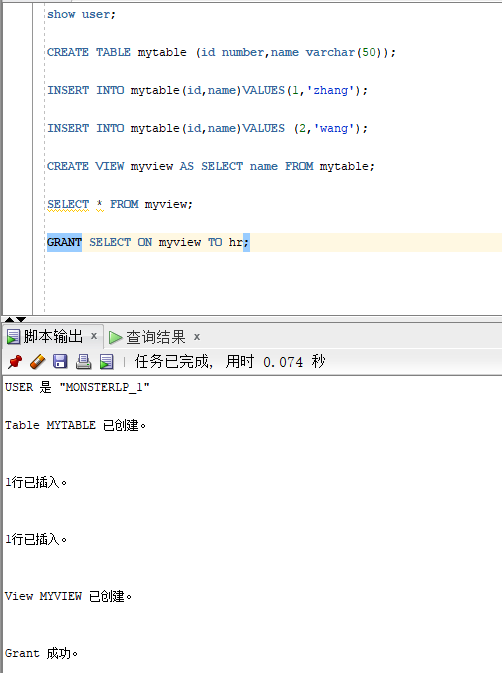
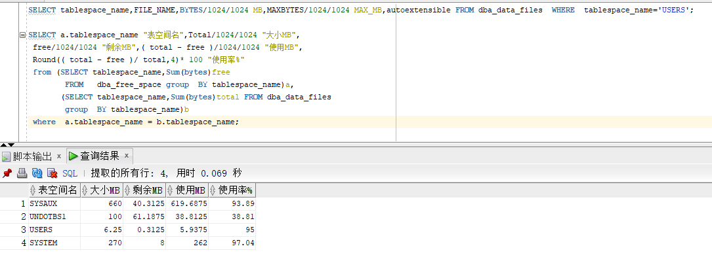
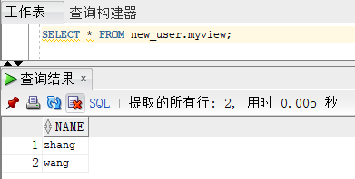

# 实验二

## 实验目的

掌握用户管理、角色管理、权根维护与分配的能力，掌握用户之间共享对象的操作技能。

## 实验内容

Oracle有一个开发者角色resource，可以创建表、过程、触发器等对象，但是不能创建视图。本训练要求：

- 在pdborcl插接式数据中创建一个新的本地角色con_res_view，该角色包含connect和resource角色，同时也包含CREATE VIEW权限，这样任何拥有con_res_view的用户就同时拥有这三种权限。

  

- 创建角色之后，再创建用户new_user，给用户分配表空间，设置限额为50M，授予con_res_view角色。

  

- 最后测试：用新用户new_user连接数据库、创建表，插入数据，创建视图，查询表和视图的数据。

  

  在新建立的用户中对用户的库进行操作

  

  对磁盘占用进行查看

  

  建立用户的代码

  ```sql
  CREATE ROLE MonsterLP;  
  
  GRANT connect,resource,CREATE VIEW TO MonsterLP;
  
  CREATE USER MonsterLP_1 IDENTIFIED BY 123 DEFAULT TABLESPACE users TEMPORARY TABLESPACE temp;
  
  ALTER USER MonsterLP_1 QUOTA 50M ON users;
  
  GRANT MonsterLP TO MonsterLP_;
  ```

  新用户对库进行操作的代码

  ```sql
  show user;
  
  CREATE TABLE mytable (id number,name varchar(50));
  
  INSERT INTO mytable(id,name)VALUES(1,'zhang');
  
  INSERT INTO mytable(id,name)VALUES (2,'wang');
  
  CREATE VIEW myview AS SELECT name FROM mytable;
  
  SELECT * FROM myview;
  
  GRANT SELECT ON myview TO hr;
  ```

  表空间占用查询代码

  ```sql
  SELECT tablespace_name,FILE_NAME,BYTES/1024/1024 MB,MAXBYTES/1024/1024 MAX_MB,autoextensible FROM dba_data_files  WHERE  tablespace_name='USERS';
  
  SELECT a.tablespace_name "表空间名",Total/1024/1024 "大小MB",
   free/1024/1024 "剩余MB",( total - free )/1024/1024 "使用MB",
   Round(( total - free )/ total,4)* 100 "使用率%"
   from (SELECT tablespace_name,Sum(bytes)free
          FROM   dba_free_space group  BY tablespace_name)a,
         (SELECT tablespace_name,Sum(bytes)total FROM dba_data_files
          group  BY tablespace_name)b
   where  a.tablespace_name = b.tablespace_name;
  ```

  在hr的库中授予视图：

  

## 实验总结

通过学习掌握用户管理、角色管理、权根维护与分配的能力，我大概了解到了oracle数据库中，用户是如何被操作的，以及用户大致的权限，通过本次实验，我粗略的掌握用户之间共享对象的操作技能。但是对于oracle数据库的学习，我还是有很多的不足，希望在本学期的学习中学到更多。


