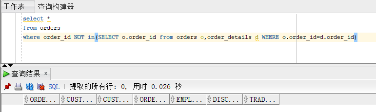

# 实验4：对象管理

## 实验目的：

了解Oracle表和视图的概念，学习使用SQL语句Create Table创建表，学习Select语句插入，修改，删除以及查询数据，学习使用SQL语句创建视图，学习部分存储过程和触发器的使用。

## 实验场景：

假设有一个生产某个产品的单位，单位接受网上订单进行产品的销售。通过实验模拟这个单位的部分信息：员工表，部门表，订单表，订单详单表。

## 实验内容：

## 建立用户：

#### 给用户授权：

```sql
alter user shuijingyelong_1 quota unlimited on USERS001;

grant alter tablespace to shuijingyelong_1;
grant create tablespace to shuijingyelong_1;
```


#### 用户建立：

```sql
Create Tablespace USERS1
datafile
'/home/oracle/app/oracle/oradata/orcl/pdborcl/pdbtest_users1_1.dbf'
  SIZE 100M AUTOEXTEND ON NEXT 256M MAXSIZE UNLIMITED,
'/home/oracle/app/oracle/oradata/orcl/pdborcl/pdbtest_users1_2.dbf'
  SIZE 100M AUTOEXTEND ON NEXT 256M MAXSIZE UNLIMITED
EXTENT MANAGEMENT LOCAL SEGMENT SPACE MANAGEMENT AUTO;
```


#### 查看用户空间：

```sql
SELECT
     *
FROM dba_tablespaces;
```


#### 创建表DEPARTMENTS：

```sql
CREATE TABLE DEPARTMENTS
(
  DEPARTMENT_ID NUMBER(6, 0) NOT NULL
, DEPARTMENT_NAME VARCHAR2(40 BYTE) NOT NULL
, CONSTRAINT DEPARTMENTS_PK PRIMARY KEY
  (
    DEPARTMENT_ID
  )
  USING INDEX
  (
      CREATE UNIQUE INDEX DEPARTMENTS_PK ON DEPARTMENTS (DEPARTMENT_ID ASC)
      NOLOGGING
      TABLESPACE USERS1
      PCTFREE 10
      INITRANS 2
      STORAGE
      (
        INITIAL 65536
        NEXT 1048576
        MINEXTENTS 1
        MAXEXTENTS UNLIMITED
        BUFFER_POOL DEFAULT
      )
      NOPARALLEL
  )
  ENABLE
)
NOLOGGING
TABLESPACE USERS1
PCTFREE 10
INITRANS 1
STORAGE
(
  INITIAL 65536
  NEXT 1048576
  MINEXTENTS 1
  MAXEXTENTS UNLIMITED
  BUFFER_POOL DEFAULT
)
NOCOMPRESS NO INMEMORY NOPARALLEL;
```


#### 创建表EMPLOYEES：

```sql
CREATE TABLE EMPLOYEES
(
  EMPLOYEE_ID NUMBER(6, 0) NOT NULL
, NAME VARCHAR2(40 BYTE) NOT NULL
, EMAIL VARCHAR2(40 BYTE)
, PHONE_NUMBER VARCHAR2(40 BYTE)
, HIRE_DATE DATE NOT NULL
, SALARY NUMBER(8, 2)
, MANAGER_ID NUMBER(6, 0)
, DEPARTMENT_ID NUMBER(6, 0)
, PHOTO BLOB
, CONSTRAINT EMPLOYEES_PK PRIMARY KEY
  (
    EMPLOYEE_ID
  )
  USING INDEX
  (
      CREATE UNIQUE INDEX EMPLOYEES_PK ON EMPLOYEES (EMPLOYEE_ID ASC)
      NOLOGGING
      TABLESPACE USERS1
      PCTFREE 10
      INITRANS 2
      STORAGE
      (
        INITIAL 65536
        NEXT 1048576
        MINEXTENTS 1
        MAXEXTENTS UNLIMITED
        BUFFER_POOL DEFAULT
      )
      NOPARALLEL
  )
  ENABLE
)
NOLOGGING
TABLESPACE USERS1
PCTFREE 10
INITRANS 1
STORAGE
(
  INITIAL 65536
  NEXT 1048576
  MINEXTENTS 1
  MAXEXTENTS UNLIMITED
  BUFFER_POOL DEFAULT
)
NOCOMPRESS
NO INMEMORY
NOPARALLEL
LOB (PHOTO) STORE AS SYS_LOB0000092017C00009$$
(
  ENABLE STORAGE IN ROW
  CHUNK 8192
  NOCACHE
  NOLOGGING
  TABLESPACE USERS1
  STORAGE
  (
    INITIAL 106496
    NEXT 1048576
    MINEXTENTS 1
    MAXEXTENTS UNLIMITED
    BUFFER_POOL DEFAULT
  )
);

CREATE INDEX EMPLOYEES_INDEX1_NAME ON EMPLOYEES (NAME ASC)
NOLOGGING
TABLESPACE USERS1
PCTFREE 10
INITRANS 2
STORAGE
(
  INITIAL 65536
  NEXT 1048576
  MINEXTENTS 1
  MAXEXTENTS UNLIMITED
  BUFFER_POOL DEFAULT
)
NOPARALLEL;

ALTER TABLE EMPLOYEES
ADD CONSTRAINT EMPLOYEES_FK1 FOREIGN KEY
(
  DEPARTMENT_ID
)
REFERENCES DEPARTMENTS
(
  DEPARTMENT_ID
)
ENABLE;

ALTER TABLE EMPLOYEES
ADD CONSTRAINT EMPLOYEES_FK2 FOREIGN KEY
(
  MANAGER_ID
)
REFERENCES EMPLOYEES
(
  EMPLOYEE_ID
)
ON DELETE SET NULL ENABLE;

ALTER TABLE EMPLOYEES
ADD CONSTRAINT EMPLOYEES_CHK1 CHECK
(SALARY>0)
ENABLE;

ALTER TABLE EMPLOYEES
ADD CONSTRAINT EMPLOYEES_CHK2 CHECK
(EMPLOYEE_ID<>MANAGER_ID)
ENABLE;

ALTER TABLE EMPLOYEES
ADD CONSTRAINT EMPLOYEES_EMPLOYEE_MANAGER_ID CHECK
(MANAGER_ID<>EMPLOYEE_ID)
ENABLE;

ALTER TABLE EMPLOYEES
ADD CONSTRAINT EMPLOYEES_SALARY CHECK
(SALARY>0)
ENABLE;
```


#### 创建表PRODUCTS：

```sql
CREATE TABLE PRODUCTS
(
  PRODUCT_NAME VARCHAR2(40 BYTE) NOT NULL
, PRODUCT_TYPE VARCHAR2(40 BYTE) NOT NULL
, CONSTRAINT PRODUCTS_PK PRIMARY KEY
  (
    PRODUCT_NAME
  )
  ENABLE
)
LOGGING
TABLESPACE "USERS1"
PCTFREE 10
INITRANS 1
STORAGE
(
  INITIAL 65536
  NEXT 1048576
  MINEXTENTS 1
  MAXEXTENTS 2147483645
  BUFFER_POOL DEFAULT
);

ALTER TABLE PRODUCTS
ADD CONSTRAINT PRODUCTS_CHK1 CHECK
(PRODUCT_TYPE IN ('耗材', '手机', '电脑'))
ENABLE;
```


#### 补充创建用户USER2：

```sql
Create Tablespace USERS2
datafile
'/home/oracle/app/oracle/oradata/orcl/pdborcl/pdbtest_users2_1.dbf'
  SIZE 100M AUTOEXTEND ON NEXT 256M MAXSIZE UNLIMITED,
'/home/oracle/app/oracle/oradata/orcl/pdborcl/pdbtest_users2_2.dbf'
  SIZE 100M AUTOEXTEND ON NEXT 256M MAXSIZE UNLIMITED
EXTENT MANAGEMENT LOCAL SEGMENT SPACE MANAGEMENT AUTO;
```


### 查询数据：

1.查询某个员工的信息

```sql
select * FROM employees WHERE employee_id=1
```


2.递归查询某个员工及其所有下属，子下属员工。

```sql
SELECT * FROM employees START WITH EMPLOYEE_ID = 1 CONNECT BY PRIOR EMPLOYEE_ID = MANAGER_ID;
```


3.查询订单表，并且包括订单的订单应收货款: Trade_Receivable= sum(订单详单表.ProductNum*订单详单表.ProductPrice)- Discount。

```sql
select * FROM orders
```


4.查询订单详表，要求显示订单的客户名称和客户电话，产品类型用汉字描述。

```sql
select o.customer_name,o.customer_tel, p.product_type AS 产品类型
FROM orders o,order_details d,products p
where o.order_id=d.order_id
and d.product_name=p.product_name
```


5.查询出所有空订单，即没有订单详单的订单。

```sql
select *  
from orders 
where order_id NOT in(SELECT o.order_id from orders o,order_details d WHERE o.order_id=d.order_id)
```



6.查询部门表，同时显示部门的负责人姓名。

```sql
select d.*,e.name 
from departments d,employees e 
where d.department_id=e.department_id sql
and e.manager_id=d.department_id
```


7.查询部门表，统计每个部门的销售总金额。

```sql
select d.department_name,SUM(sum1)
FROM (
select (d.product_num*d.product_price) sum1
from order_details d,orders o,departments d,employees e
WHERE d.department_id=e.department_id
and o.employee_id = e.employee_id
and o.order_id=d.order_id
),departments d
group by d.department_name
```


