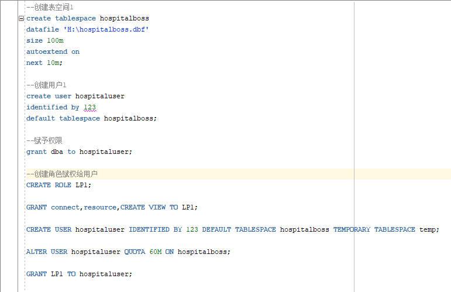
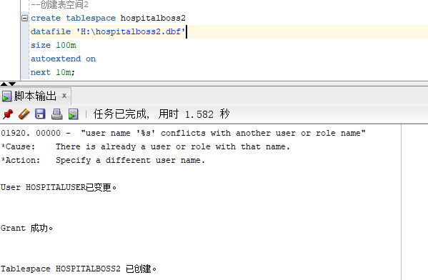
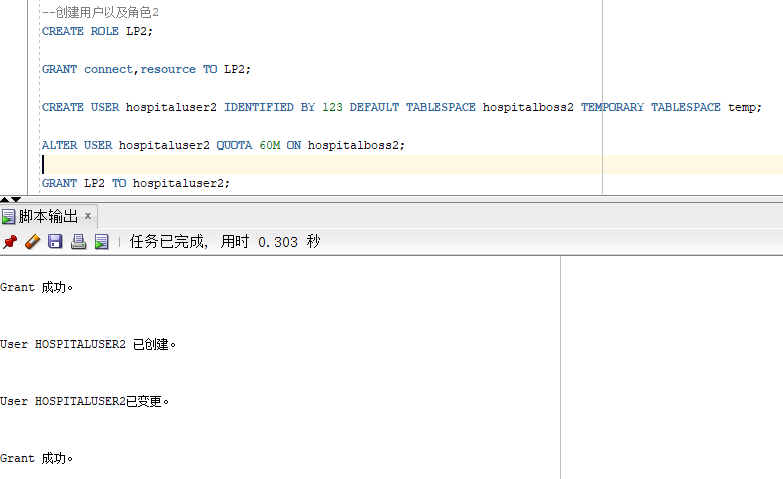
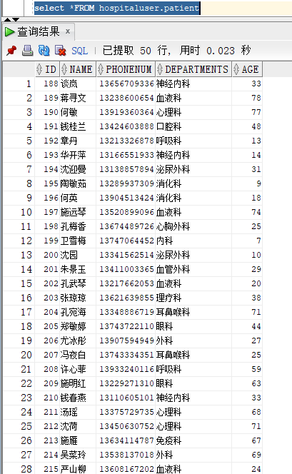
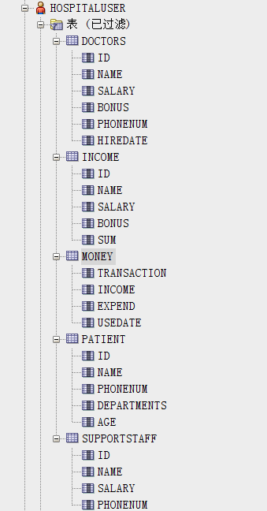
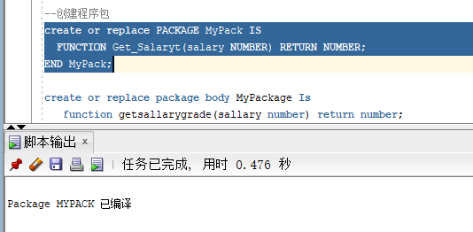
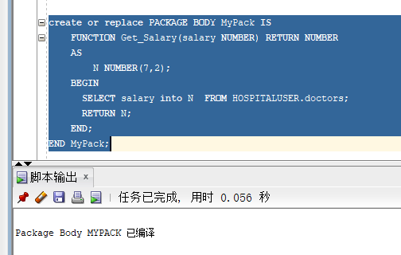

### 基于Oracle的医院信息系统数据库设计

#### 1.创建表空间及用户

**用户创建成功**

#### 2. 在用户hospitaluser下创建表

**创建医生信息表**

**创建杂项收支表**

**创建薪资统计表**

**创建患者表**

**创建后勤人员表**

**表结构**

#### 3.创建程序包

**创建程序包**

**创建函数**

**查看表空间使用率**

#### 4.导出备份

